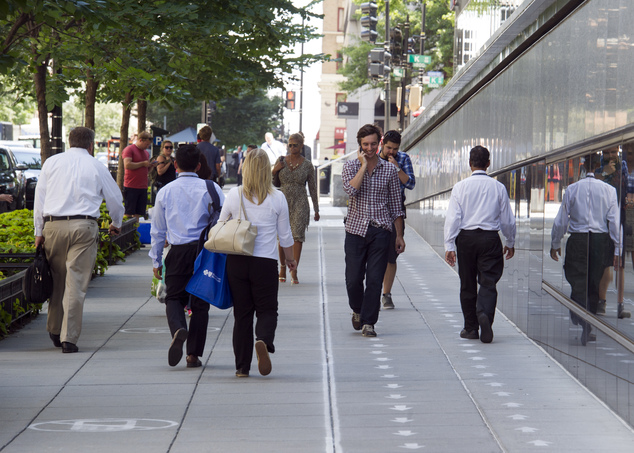
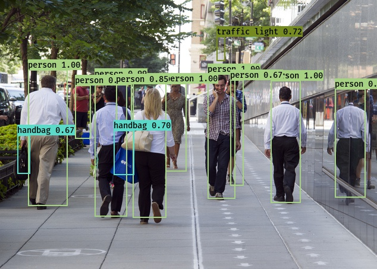
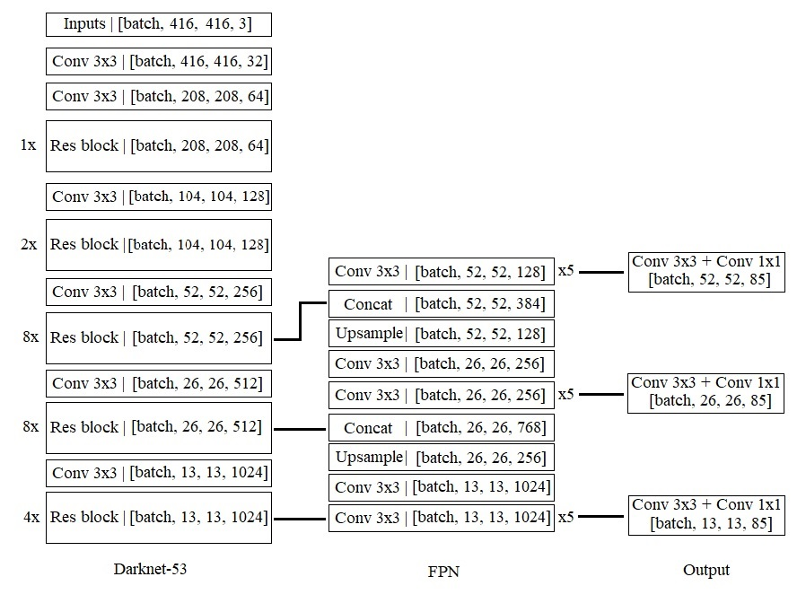
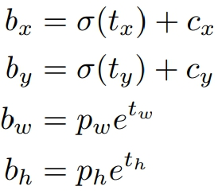
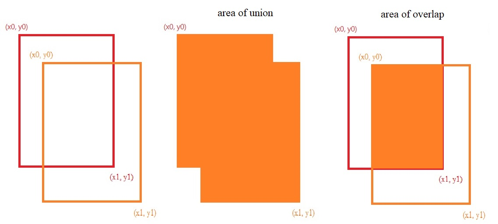

# YOLOv3_Tensorflow

A simple tenssorflow implement for yolov3. 
(you can get the weight in the releases)

For more detail:

- [paper](https://arxiv.org/abs/1804.02767)

Here are some result in our test:






## Setup

- Windows 10
- Tensorflow 1.6.0
- Python 3.6.4

## How to use
``` bash
python main.py --input_img [YOUR INPUT] --output_img [YOUR OUTPUT]
``` 

## Detail

- **Network Architecture**



- **Loss Function**

- **Output**
<div align=center>
``` bash
boxes, scores = self.sess.run([self.boxes, self.scores], 
                               feed_dict={self.inputs: inputs, self.ratio: ratio})

mask = scores >= _SCORE_THRESHOLD
boxes_ = []
scores_ = []
classes_ = []
for Class in range(len(self.class_names)):          
            
    cls_boxes = boxes[np.array(mask[:, Class]), :]   
    cls_scores = scores[np.array(mask[:, Class]), Class]
    while cls_boxes.shape[0] != 0:
        cls_boxes, cls_scores, max_box, max_score = NMS(cls_boxes, cls_scores, _IOU_THRESHOLD)             
        boxes_.append(max_box)                
        scores_.append(max_score)
        classes_.append(np.ones_like(max_score, dtype=int) * Class)       
```

`boxes`: [10647, 4] 

`scores`: [10647, 80]

For an image of size 416 * 416, network prdicts ((52*52) + (26*26) + (13*13)) * 3 = 10647 bounding boxes with 4 coordinates(bx, by, bw, bh) and 80 class predictions in COCO dataset.

For the real output, `mask` use to divide `score` into positive and negative with `_SCORE_THRESHOLD = 0.5` then use the `NMS` by computing `IOU` to choose the correct bounding boxes and classification.

- **NMS**
``` bash
def NMS(cls_boxes, cls_scores, iou_threshold):
            
    max_idx = np.argmax(cls_scores, 0)  
    max_box = cls_boxes[max_idx]
    max_score = np.array(cls_scores[max_idx])
    max_mask = cls_boxes !=  max_box             
    max_mask = np.reshape(max_mask[:, 0:1], [-1])
    cls_boxes = cls_boxes[np.array(max_mask), :]
    cls_scores = cls_scores[np.array(max_mask)]
    ious = [IOU(max_box, x) for x in cls_boxes]
    iou_mask = np.array(ious) <  iou_threshold
    cls_boxes =  cls_boxes[iou_mask, :]
    cls_scores = cls_scores[iou_mask]               
    max_box = np.reshape(max_box, [1,-1])
    max_score = np.reshape(max_score, [-1])   
    return cls_boxes, cls_scores, max_box, max_score 
```
For each class, find the maximum from the `cls_scores` and select the corresponding box to save as an output and calculate the IOU 
with other boxes. After that delete the boxes from `cls_boxes` if the IOU bigger than the `iou_threshold = 0.5`.
Repeat the following steps until the `cls_boxes` is empty.

- **IOU**
``` bash
def IOU(box1, box2):

    b1_x0, b1_y0, b1_x1, b1_y1 = box1
    b2_x0, b2_y0, b2_x1, b2_y1 = box2
    int_x0 = max(b1_x0, b2_x0)
    int_y0 = max(b1_y0, b2_y0)
    int_x1 = min(b1_x1, b2_x1)
    int_y1 = min(b1_y1, b2_y1)
    int_area = (int_x1 - int_x0) * (int_y1 - int_y0)
    b1_area = (b1_x1 - b1_x0) * (b1_y1 - b1_y0)
    b2_area = (b2_x1 - b2_x0) * (b2_y1 - b2_y0)
    iou = int_area / (b1_area + b2_area - int_area + 1e-05)
    return iou
```
`box1`: ground-truth bounding boxes

`box2`: predicted bounding boxes

`iou`: area of overlap / area of union



- **Sample(NMS + IOU)**
```bash
                 while cls_boxes.shape[0] != 0:
--------------------------------------------------------------------
cls_boxes:  [[153, 278, 300, 312]
             [125, 714, 315, 747]
             [140, 785, 229, 796]]
cls_scores:  [0.74, 0.50, 0.54]

max_boxes: [153, 278, 300, 312] (max_idx = 0)
IOU: 
    max_X0(153, 125), max_X0(153, 140) = [153, 153] (TopLeft x)
    max_Y0(278, 714), max_Y0(278, 785) = [714, 785] (TopLeft y)
    min_X1(300, 315), min_X1(300, 229) = [300, 229] (BottomRight x)
    min_Y1(312, 747), min_Y1(313, 796) = [312, 313] (BottomRight y)
    
    overlap = [-59094, -35872] (no overlap if <= 0)
    union = [65364, 36851]
    iou = [-0.90, -0.97] (overlap / union) < iou_threshold = 0.5
    
cls_boxes: [[125, 714, 315, 747]
            [140, 785, 229, 796]]    
--------------------------------------------------------------------
cls_boxes: [[125, 714, 315, 747]
            [140, 785, 229, 796]]
cls_scores: [0.50, 0.54]

max_boxes: [140, 785, 229, 796] (max_idx = 1)
IOU:
    max_X0(140, 125) = [140] (TopLeft x)
    max_Y0(785, 714) = [785] (TopLeft y)
    min_X1(229, 315) = [229] (BottomRight x)
    min_Y1(796, 747) = [747] (BottomRight y)
    
    overlap = [-3382] (no overlap if <= 0)
    union = [10631]
    iou = [-0.32] (overlap / union) < iou_threshold = 0.5
    
cls_boxes: [[125, 714, 315, 747]]
--------------------------------------------------------------------
cls_boxes: [[125, 714, 315, 747]]
cls_scores: [0.50]

max_boxes: [125, 714, 315, 747]
cls_boxes: []
--------------------------------------------------------------------
                 cls_boxes.shape[0] == 0: End Loop  
```
