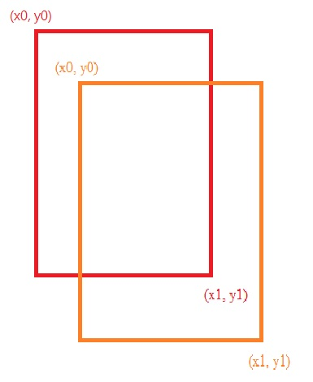

# YOLOv3_Tensorflow

A simple tenssorflow implement for yolov3. 
(you can get the weight in the releases)

For more detail:

- [paper](https://arxiv.org/abs/1804.02767)

Here are some result in our test:


## Setup

- Windows 10
- Tensorflow 1.6.0
- Python 3.6.4

## How to use
``` bash
python main.py --input_img [YOUR INPUT] --output_img [YOUR OUTPUT]
``` 

## Code Introduction

- IOU
``` bash
def IOU(box1, box2):

    b1_x0, b1_y0, b1_x1, b1_y1 = box1
    b2_x0, b2_y0, b2_x1, b2_y1 = box2
    int_x0 = max(b1_x0, b2_x0)
    int_y0 = max(b1_y0, b2_y0)
    int_x1 = min(b1_x1, b2_x1)
    int_y1 = min(b1_y1, b2_y1)
    int_area = (int_x1 - int_x0) * (int_y1 - int_y0)
    b1_area = (b1_x1 - b1_x0) * (b1_y1 - b1_y0)
    b2_area = (b2_x1 - b2_x0) * (b2_y1 - b2_y0)
    iou = int_area / (b1_area + b2_area - int_area + 1e-05)
    return iou
```
```box1```: ground-truth bounding boxes
```box2```: predicted bounding boxes
```iou```: area of overlap / area of union

