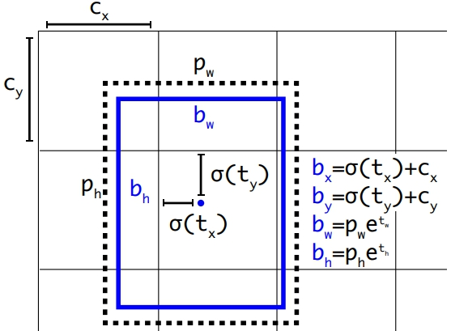

# YOLOv3_Tensorflow

A simple tensorflow implement for yolov3. 
(you can get the weight in the releases)

For more: 

- [paper](https://arxiv.org/abs/1804.02767)

Here are some result in our test:


# Setup

- Windows 10
- Tensorflow 1.6.0
- Python 3.6.4

# How to use
``` bash
python main.py --input_img [YOUR INPUT] --output_img [YOUR OUTPUT]
``` 

# Detail

### Network Architecture

<div align=center></div>

YOLOv3 predicts boxes at 3 different scales 13, 26 and 52 by using Darknet-53 and feature pyramid nerwork(FPN). It has 75 convolutional layers with the 416 x 416 inputs, then an input image will yield an output of size 13 x 13 by darknet-53 and FPN will use these feature maps from eariler in the nerwork which have stride 32, 16 and 8.

- **Anchor box**

The direct prediction about width and height of the bounding boxes is a intuitive idea. However, it might lead to unstable gradients during training. Instead, simply offset with the predefined bounding boxes is another useful method called anchors. 

### Predictions

The output tensor is N × N × S x (4 + 1 + 80) for the 4 bounding box offsets, 1 objectness prediction, and 80 class predictions. N x N x S represents the number of grids with S = 3 anchor boxes.


`bx, by, bw, bh` are the center coordinates, width and height of bounding boxes.

`tx, ty, tw, th` are the prediction what the network outputs.

`cx, cy` are the top-left coordinates of the grids.

`pw, ph` are the anchor-box dimensions for the bounding boxes. 

<div align=center></div>

- **Coordinates**

Instead of predicting the center directly, YOLO predicts the offsets relative to the top-left corner of the gird. It is normalised between 0 and 1 by the dimensions of the grid. 

`bx = (tx ∗ wa) + xa`  

`by = (ty ∗ ha) + ya`

(x and y are the actual center coordinates)

For example, a prediction of tx = 1 would shift the box to the right by the width of the anchor box, a prediction of tx = −1
would shift it to the left by the same amount.

- **Dimensions**

The predictions `tw = log(bw / wa)` and `th = log(bh / ha)` will multiply with an anchor as a aspect ratio to adjust the size.

`bw = wa * e^tw`

`bh = ha * e^th`

The actual width and height are also normalised by the image, so the resultant predictions is need to multiply the size of the image.(416 in this test)

- **Objectness Score**

Confidence scored reflect the probability that an object is contained inside the box. Instead objectness score is using logistic regression. Objectness shoud be _one_ if the bounding box overlap with groud truth is more than other and should be _zero_ or _ignore_ if overlap is more or not than the threshold (0.5 here).

- **Class Prediction**

YOLO used to softmax the class scores before v3. However, using a softmax imposes the assumption that each box has exactly one class which is often not the case. Instead v3 uses independent logistic classifiers like binary cross-entropy which can models the data for multilabel class prediction better.

### Loss Function

Training use sum of squared error loss(width, height) and binary cross-entropy(coordinate, objectness and class). 

Loss penalizes coordinate and class predictions error if an object is assigned to a grid, otherwise it only penalizes objectness.

```bash
def compute_loss(yolo_outputs, y_true, anchors, num_classes, ratio):

    def BCE(logits, labels):
        return tf.reduce_sum(
                tf.nn.sigmoid_cross_entropy_with_logits(logits=logits, labels=labels))
        
    anchor_mask = [[6, 7, 8], [3, 4, 5], [0, 1, 2]]
    # input_shape = (416 * 416) = yolo_outputs[0] * 32 = (13 * 13) * 32
    input_shape = tf.cast(tf.shape(yolo_outputs[0])[1:3] * 32, tf.dtype(y_true[0]))
    # grid shape(3 scale) -> [13,13] [26,26] [52,52]
    grid_shapes = [tf.cast(tf.shape(yolo_outputs[scale])[1:3], tf.dtype(y_true[0])) for scale in range(3)]
    loss = 0
    batch = tf.shape(yolo_outputs[0])[0] 
    # muti scale(3)
    for scale in range(3):
        
        # obj and noobj are mask about the probability of object in the grid cell or not
        obj = y_true[scale][..., 4:5]  
        noobj = 1 - obj
        
        # COCO dataset for 80 classes
        true_class_probs = y_true[scale][..., 5:] 
 
        grid, pred, box_xy, box_wh = compute_boxes(yolo_outputs[scale],
                                                   anchors[anchor_mask[scale]], 
                                                   num_classes, 
                                                   ratio,
                                                   is_train=True)
        box = tf.concat([box_xy, box_wh])
        
        # box_loss_scale is as λ to counterpoise the box size  
        box_loss_scale = 2 - y_true[scale][..., 2:3] * y_true[scale][..., 3:4]
        
        # Note the xy and wh are normalised by grid size and image size.
        # b(x, y) = σ(t(x,y)) + GRID_CELL(x,y) / grid_size(13, 26, 52)                             
        # b(w, h) = (p(w,h) * e^t(w ,h) / image_size(416)
        box_xy_true = y_true[scale][..., :2] * grid_shapes[scale][::-1] - grid
        box_wh_true = tf.log(y_true[scale][..., 2:4] / anchors[anchor_mask[scale]] * input_shape[-1])        

        # Find ignore mask for each batch.
        ignore = tf.TensorArray(tf.dtype(y_true[0]), size=1, dynamic_size=True)
    
        def cond(n, ignore):
                  return n < batch
        def body(n, ignore):
            true_box = tf.boolean_mask(y_true[scale][n, ..., 0:4], tf.cast(obj, 'bool'))
            iou = box_IoU(box[n], true_box)
            max_iou = tf.argmax(iou, axis=-1)
            ignore = ignore.write(n, tf.cast(max_iou < ignore_thresh, tf.dtype(true_box)))
            return n + 1, ignore

        _, ignore = tf.while_loop(cond, body, [0, ignore])
        ignore = tf.expand_dims(ignore.stack(), -1)
        
        # Compute the loss 
        xy_loss = obj * box_loss_scale * BCE(pred[..., 0:2], box_xy_true)
        wh_loss = obj * box_loss_scale * tf.square(box_wh_true - pred[..., 2:4]) / 2
        objectness_loss = obj * BCE(pred[..., 4:5], obj) + noobj * BCE(pred[..., 4:5], obj) * ignore
        class_loss = obj * BCE(pred[..., 5:], true_class_probs)

        loss += (xy_loss + wh_loss + objectness_loss + class_loss) / tf.cast(batch, tf.dtype(yolo_outputs[0]))

    return loss
```

### Output Processing
 
For an image of size 416 * 416, network prdicts ((52x52) + (26x26) + (13x13)) x 3 = 10647 bounding boxes with 4 coordinates(bx, by, bw, bh) and 80 class predictions in COCO dataset.
 
``` bash
boxes, scores = self.sess.run([self.boxes, self.scores], 
                               feed_dict={self.inputs: inputs, self.ratio: ratio})

mask = scores >= _SCORE_THRESHOLD
boxes_ = []
scores_ = []
classes_ = []
for Class in range(len(self.class_names)):          
            
    cls_boxes = boxes[np.array(mask[:, Class]), :]   
    cls_scores = scores[np.array(mask[:, Class]), Class]
    while cls_boxes.shape[0] != 0:
        cls_boxes, cls_scores, max_box, max_score = NMS(cls_boxes, cls_scores, _IOU_THRESHOLD)             
        boxes_.append(max_box)                
        scores_.append(max_score)
        classes_.append(np.ones_like(max_score, dtype=int) * Class)       
```

`boxes`: [10647, 4] 

`scores`: [10647, 80]

The real output uses `mask` to set scores into positive and negative based on `_SCORE_THRESHOLD = 0.5`. Then `NMS` is used by computing `IOU` to choose correct bounding boxes and classifications.

#### NMS
``` bash
def NMS(cls_boxes, cls_scores, iou_threshold):
            
    max_idx = np.argmax(cls_scores, 0)  
    max_box = cls_boxes[max_idx]
    max_score = np.array(cls_scores[max_idx])
    max_mask = cls_boxes !=  max_box             
    max_mask = np.reshape(max_mask[:, 0:1], [-1])
    cls_boxes = cls_boxes[np.array(max_mask), :]
    cls_scores = cls_scores[np.array(max_mask)]
    ious = [IOU(max_box, x) for x in cls_boxes]
    iou_mask = np.array(ious) <  iou_threshold
    cls_boxes =  cls_boxes[iou_mask, :]
    cls_scores = cls_scores[iou_mask]               
    max_box = np.reshape(max_box, [1,-1])
    max_score = np.reshape(max_score, [-1])   
    return cls_boxes, cls_scores, max_box, max_score 
```
For each class, find the maximum from the `cls_scores` and select the corresponding box to save as an output and calculate the IOU 
with other boxes. After that delete the boxes from `cls_boxes` if the IOU is bigger than the `iou_threshold = 0.5`.
Repeat the following steps until the `cls_boxes` is empty.

#### IOU
``` bash
def IOU(box1, box2):

    b1_x0, b1_y0, b1_x1, b1_y1 = box1
    b2_x0, b2_y0, b2_x1, b2_y1 = box2
    int_x0 = max(b1_x0, b2_x0)
    int_y0 = max(b1_y0, b2_y0)
    int_x1 = min(b1_x1, b2_x1)
    int_y1 = min(b1_y1, b2_y1)
    int_area = (int_x1 - int_x0) * (int_y1 - int_y0)
    b1_area = (b1_x1 - b1_x0) * (b1_y1 - b1_y0)
    b2_area = (b2_x1 - b2_x0) * (b2_y1 - b2_y0)
    iou = int_area / (b1_area + b2_area - int_area + 1e-05)
    return iou
```
`box1`: ground-truth bounding boxes

`box2`: predicted bounding boxes

`iou`: area of overlap / area of union


### Sample
```bash
Compute the NMS and IOU like the following:

                 while cls_boxes.shape[0] != 0:
--------------------------------------------------------------------
cls_boxes:  [[153, 278, 300, 312]
             [125, 714, 315, 747]
             [140, 785, 229, 796]]
cls_scores:  [0.74, 0.50, 0.54]

max_boxes: [153, 278, 300, 312] (max_idx = 0)
IOU: 
    max_X0(153, 125), max_X0(153, 140) = [153, 153] (TopLeft x)
    max_Y0(278, 714), max_Y0(278, 785) = [714, 785] (TopLeft y)
    min_X1(300, 315), min_X1(300, 229) = [300, 229] (BottomRight x)
    min_Y1(312, 747), min_Y1(313, 796) = [312, 313] (BottomRight y)
    
    overlap = [-59094, -35872] (no overlap if <= 0)
    union = [65364, 36851]
    iou = [-0.90, -0.97] (overlap / union) < iou_threshold = 0.5
    
cls_boxes: [[125, 714, 315, 747]
            [140, 785, 229, 796]]    
--------------------------------------------------------------------
cls_boxes: [[125, 714, 315, 747]
            [140, 785, 229, 796]]
cls_scores: [0.50, 0.54]

max_boxes: [140, 785, 229, 796] (max_idx = 1)
IOU:
    max_X0(140, 125) = [140] (TopLeft x)
    max_Y0(785, 714) = [785] (TopLeft y)
    min_X1(229, 315) = [229] (BottomRight x)
    min_Y1(796, 747) = [747] (BottomRight y)
    
    overlap = [-3382] (no overlap if <= 0)
    union = [10631]
    iou = [-0.32] (overlap / union) < iou_threshold = 0.5
    
cls_boxes: [[125, 714, 315, 747]]
--------------------------------------------------------------------
cls_boxes: [[125, 714, 315, 747]]
cls_scores: [0.50]

max_boxes: [125, 714, 315, 747]
cls_boxes: []
--------------------------------------------------------------------
                 cls_boxes.shape[0] == 0: End Loop  
```
